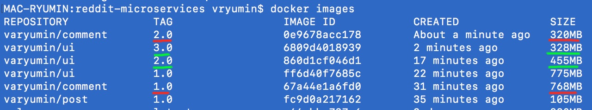
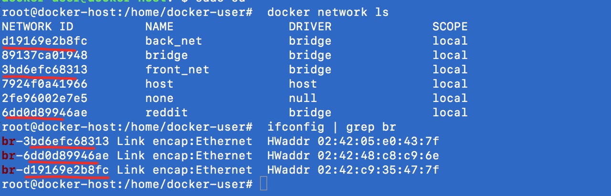
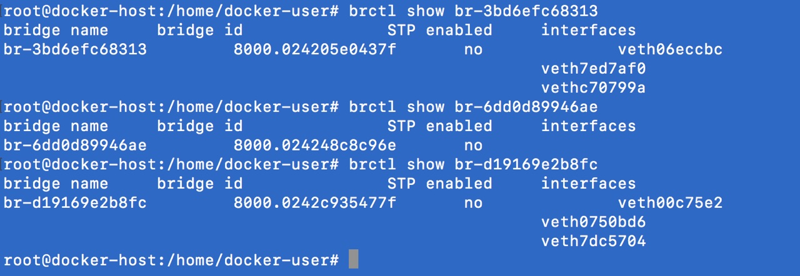
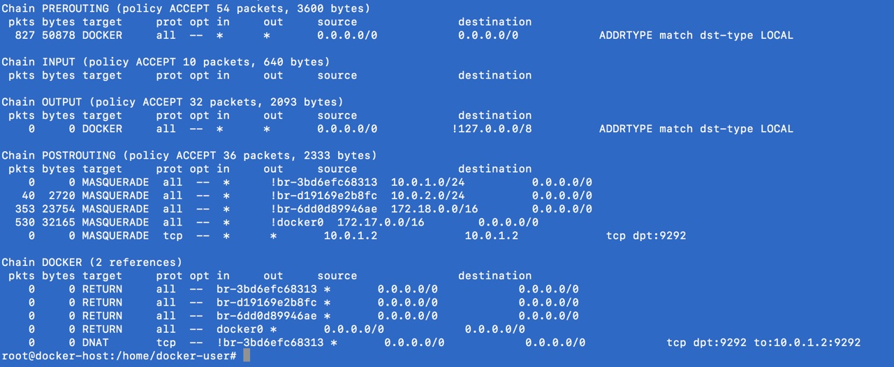
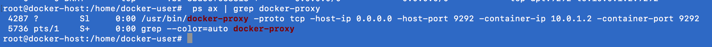
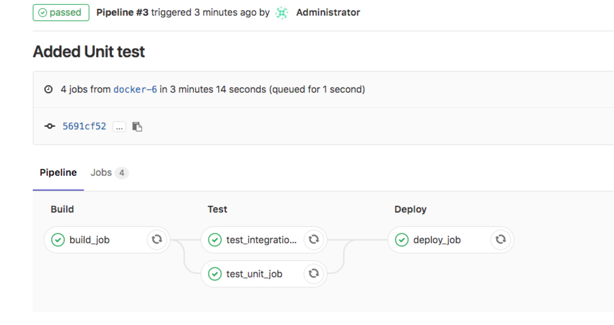
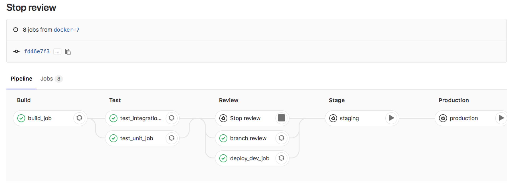
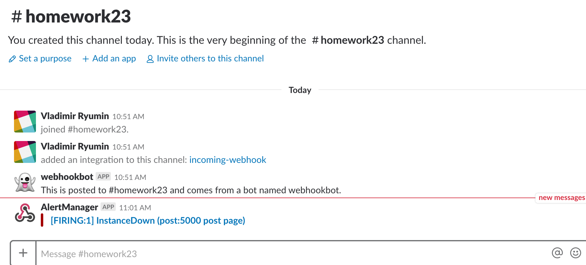

# VARyumin_microservices

## Homework  14

Использованные в ходе выполнени команды

```
docker version
docker run hello-world - Запуск контейнера из образа
docker ps - Список запущенных контейнеров
docker images - Список образов
docker run -it ubuntu:16.04 /bin/bash
docker ps -a --format "table {{.ID}}\t{{.Image}}\t{{.CreatedAt}}\t{{.Names}}"
docker start - запуск остановленного контейнера
docker attach - подсоединение терминала к контейнеру
docker exec - запуск нового процесса внутри контейнера
docker commit - создает image из контейнера
docker inspect - low -level information about docker object
docker kill - посылает SIGKILL (безусловное завершение процесса)
docker stop - SIGTERM (остановка приложения)
docker system df - информация о дисковом пространстве (сколько занято образами, контейнерами, volume)
docker rm - удаление контейнера Ex: docker rm $(docker ps -a -q)
docker  rmi - удаление образа Ex: docker rmi $(docker images -q)
```

## Homework 15

1. Создан новый проект в gcloud
2. Создал Docker-хост

```
docker-machine create --driver google \
--google-project docker-198106 \
--google-zone europe-west1-b \
--google-machine-type g1-small \
--google-machine-image $(gcloud compute images list --filter ubuntu-1604-lts --uri) \
docker-host
```
3. Добавил 4 файла:
> Dockerfile
> mongod.conf
> db_config
> start.sh

4. Произвёл сборку командой:
> docker build -t reddit:latest .
5. запустил контейнер
> docker run --name reddit -d --network=host reddit:latest
6. Открыл порт 9292
```
gcloud compute firewall-rules create reddit-app \
--allow tcp:9292 --priority=65534 \
--target-tags=docker-machine \
--description="Allow TCP connections" \
--direction=INGRESS
```
7. Зарегистрировался в "Docker hub"
8. Залогинелся в консоли на "Docker hub"
```
docker login
Login with your Docker ID to push and pull images from Docker Hub. If you don't have a Docker ID, head over to https://hub.docker.com to create one.
Username: varyumin
Password:
Login Succeeded
```
9. Загрузил образ на docker hub
```
docker push varyumin/otus-reddit:1.0
The push refers to repository [docker.io/varyumin/otus-reddit]
01a42ad32823: Pushed
9f1b6153c0ae: Pushed
79468bccfed2: Pushed
571c1cb72f10: Pushed
df7c5b9b9bde: Pushed
779f7eb7e77f: Pushed
b7a823e50c49: Pushed
d94151d9dc6b: Pushed
45620340f8c2: Pushed
db584c622b50: Mounted from library/ubuntu
52a7ea2bb533: Mounted from library/ubuntu
52f389ea437e: Mounted from library/ubuntu
88888b9b1b5b: Mounted from library/ubuntu
a94e0d5a7c40: Mounted from library/ubuntu
1.0: digest: sha256:4e62aaa84a4619c703f63b8819fa1bde6773ca45312d49ffd597eeb412698dbd size: 3241
```

## Homework 16

#### 1. Новая структура приложения
1) Все файлы предыдущих домашних заданий (14 и 15) перенесены в каталог monolith
2) Домашнее задание 16 находится в каталоге reddit-microservices. Приложение разбито на 3 каталога:

      - post-py - сервис отвечающий за написание постов
      - comment - сервис отвечающий за написание комментариев
      - ui - веб-интерфейс, работающий с другими сервисами
      - Отдельно создан контейнер с БД на базе MongoDB
3) Установить linter не удалось на CentOs 7, поэтому воспользовался сайтом: https://www.fromlatest.io
#### 2. Dockerfile сервисов
1) Сервис post-py
```Docker
FROM python:3.6.0-alpine
RUN pip install flask pymongo

WORKDIR /app
COPY . /app

RUN pip install -r /app/requirements.txt

ENV POST_DATABASE_HOST=post_db \
    POST_DATABASE=posts

CMD ["python3", "post_app.py"]
```
Заменено использование ADD на COPY. ENV записано в одну строку. Больше файл изменений не притерпел.
Онлайн сервис linter предложений по улучшению не показал.

2) Сервис comment
```Docker
FROM ruby:2.2
RUN apt-get update -qq && \
    apt-get install -y --no-install-recommends build-essential &&\
    rm -rf /var/lib/apt/lists/*

ENV APP_HOME /app
RUN mkdir $APP_HOME
WORKDIR $APP_HOME

COPY Gemfile* $APP_HOME/
RUN bundle install
COPY . $APP_HOME

ENV COMMENT_DATABASE_HOST=comment_db
ENV COMMENT_DATABASE=comments

CMD ["puma"]
```
Заменено использование ADD на COPY. Онлайн linter предложил удалять кеш rm -rf /var/lib/apt/lists/* и использовать конструкцию --no-install-recommends.
Эти изменения повелкли к изменению размера образа на 10 МБ.
Без рекомендаций linter:
```bash
[kirill@localhost reddit-microservices]$ docker images
REPOSITORY                  TAG                 IMAGE ID            CREATED             SIZE
varyumin/comment   1.0                 ae9e46b04522        16 minutes ago      771MB
```
После применения рекомендация linter:
```bash
REPOSITORY                  TAG                 IMAGE ID            CREATED             SIZE
varyumin/comment   1.0                 bd415ce462db        9 minutes ago       761MB
```
3) Сервис UI
```Docker
FROM ruby:2.2
RUN apt-get update -qq && \
    apt-get install -y --no-install-recommends build-essential && \
    rm -rf /var/lib/apt/lists/*

ENV APP_HOME /app
RUN mkdir $APP_HOME
WORKDIR $APP_HOME
COPY Gemfile* $APP_HOME/

RUN bundle install
COPY . $APP_HOME
ENV POST_SERVICE_HOST=post
ENV POST_SERVICE_PORT=5000
ENV COMMENT_SERVICE_HOST=comment
ENV COMMENT_SERVICE_PORT=9292
CMD ["puma"]
```
Заменено использование ADD на COPY. Онлайн linter предложил удалять кеш rm -rf /var/lib/apt/lists/* и использовать конструкцию --no-install-recommends.
Эти изменения повелкли к изменению размера образа на 11 МБ.
Без рекомендаций linter:
```bash
REPOSITORY                  TAG                 IMAGE ID            CREATED             SIZE
varyumin/ui        1.0                 c4e566f81f5a        15 minutes ago      779MB
```
После применения рекомендация linter:
```bash
REPOSITORY                  TAG                 IMAGE ID            CREATED              SIZE
varyumin/ui        1.0                 93c6eb4456a2        About a minute ago   768MB
```
#### 3. Сборка приложений
Команды для сборки приложений:
```bash

docker pull mongo:latest
docker build -t varyumin/post:1.0 ./post-py
docker build -t varyumin/comment:1.0 ./comment
docker build -t varyumin/ui:1.0 ./ui
```
Сборка приложения UI началалось не с первого пункта, так как docker уже успел закешировать несколько слоев при выполнении comment.

#### 4. Запуск приложений
1) Создадим специальную сеть для приложения
```bash
docker network create reddit
```
Создали bridge-сеть для контейнеров, так как сетевые алиасы не работают в сети по умолчанию.

2) Запустим контейнеры в созданные сети с алиасами к контейнерам. Команды для запуска контейнеров:
```bash
docker run -d --network=reddit --network-alias=post_db --network-alias=comment_db mongo:latest
docker run -d --network=reddit --network-alias=post varyumin/post:1.0
docker run -d --network=reddit --network-alias=comment varyumin/comment:1.0
docker run -d --network=reddit -p 9292:9292 varyumin/ui:1.0
```
#### 5. Задание со звездочкой
Конмады для запусков контейнеров с новыми сетевыми алиасами. Переменные окружения задаются в команде:
```bash
docker run -d --network=reddit --network-alias=post_db_mydocker --network-alias=comment_db_mydocker mongo:latest
docker run -d --network=reddit --network-alias=post_mydocker -e POST_DATABASE_HOST=post_db_mydocker varyumin/post:1.0
docker run -d --network=reddit --network-alias=comment_mydocker -e COMMENT_DATABASE_HOST=comment_db_mydocker varyumin/comment:1.0
docker run -d --network=reddit -p 9292:9292 -e POST_SERVICE_HOST=post_mydocker -e COMMENT_SERVICE_HOST=comment_mydocker varyumin/ui:1.0
```
#### 6. Улучшение образа UI
Собран образ на базе Ubuntu - версия 2. Так же применены все рекомендации linter. Образ на основе ruby переименрован в Dockerfile_ruby.
Результат:
```bush
[kirill@localhost reddit-microservices]$ docker images
REPOSITORY                  TAG                 IMAGE ID            CREATED             SIZE
varyumin/ui        2.0                 6e4896f7e84d        21 seconds ago      394MB
varyumin/ui        1.0                 93c6eb4456a2        45 minutes ago      768MB
```
Образ уменьшился почти в 2 раза - 48,7%
#### 7. Задание со звездочкой. Образ на основе Alpine Linux
Собран образ на базе Apline Linix - версия 3. Так же применены все рекомендации linter. Образ на основе Ubuntu переименрован в Dockerfile_ubuntu.
Результат:
docker_images_size


Применение рекомендация linter ведет к снижению замнаиемого образа, так как чистится кеш.

Рекомендации от linter позволяют сделать вывод, что удаление временных файлов, кешей и другого мусора так же позволяют уменьшить образ.
Уменьшение количества слоев так же ведет к меньшению образа.

#### 8. Docker Volume
1) Создадим docker volume
```bas
docker volume create reddit_db
```
2) Запустим контейнеры, используя volume
```bash
docker run -d --network=reddit --network-alias=post_db --network-alias=comment_db -v reddit_db:/data/db mongo:latest
docker run -d --network=reddit --network-alias=post varyumin/post:1.0
docker run -d --network=reddit --network-alias=comment varyumin/comment:1.0
docker run -d --network=reddit -p 9292:9292 varyumin/ui:2.0
```
Запуск контейнеров с volume позволило удалять и запускать контейнер без потери данных в базе данных.


## Homework 17

### Подключаемся к ранее созданному docker host’у

> docker-machine ls

```markdown
NAME          ACTIVE   DRIVER   STATE     URL                        SWARM   DOCKER        ERRORS
docker-host   *        google   Running   tcp://35.205.246.70:2376           v18.02.0-ce  
```

> eval $(docker-machine env docker-host)

## Работа с сетью в Docker

### None network driver

1. Запустим контейнер с использованием none-драйвера, с временем жизни 100 секунд, по истечении автоматически удаляется. В качестве образа используем joffotron/docker-net-tools, в него входят утилиты bind-tools, net-tools и curl.

```bash
docker run --network none --rm -d --name net_test joffotron/docker-net-tools -c "sleep 100"
docker exec -ti net_test ifconfig
```

```markdown
В результате, видим:
• что внутри контейнера из сетевых интерфейсов существует только loopback.
• сетевой стек самого контейнера работает (ping localhost), но без возможности контактировать с внешним миром.
• Значит, можно даже запускать сетевые сервисы внутри такого контейнера, но лишь для локальных экспериментов
```


2. Запустили контейнер в сетевом пространстве docker-хоста

```bash
docker run --network host --rm -d --name net_test joffotron/docker-net-tools -c "sleep 100"
```

3. Вывод команды docker exec -ti net_test ifconfig

Вывод команды docker exec -ti net_test ifconfig

Видим, что значения совпадают.

4. Запустили docker run --network host -d nginx несколько раз, а контейнер всё равно один запущен.

5. На docker-host машине выполнили команду:

```bash
> sudo ln -s /var/run/docker/netns /var/run/netns

```
Теперь можно просматривать существующие неймспейсы с помощью

```bash
> sudo ip netns
```

#### Примечание: ip netns exec <namespace> <command> - позволит выполнять команды в выбранном namespace

## Bridge network driver

##### 6. Создаём brige сеть в  docker

```bash
docker network create reddit --driver bridge
```
##### 7. Запускаем наш проект reddit с использованием brige-сети:

```bash
> docker run -d --network=reddit mongo:latest
> docker run -d --network=reddit  varyumin/post:1.0
> docker run -d --network=reddit  varyumin/comment:1.0
> docker run -d --network=reddit -p 9292:9292  varyumin/ui:1.0
```

Наши сервисы ищут друг друга по ДНС именам.

##### 8. Присваиваем контейнерам имена или алиасы:

```bash
> docker run -d --network=reddit --network-alias=post_db --network-alias=comment_db mongo:latest
> docker run -d --network=reddit --network-alias=post  varyumin/post:1.0
> docker run -d --network=reddit --network-alias=comment  varyumin/comment:1.0
> docker run -d --network=reddit -p 9292:9292  varyumin/ui:1.0
```

##### 9. Убиваем все docker контейнеры

> docker kill $(docker ps -q)

##### 10. Создаём docker сети для фронтэндв и бекэнда:

> docker network create back_net —subnet=10.0.2.0/24
> docker network create front_net --subnet=10.0.1.0/24

##### 11. Запускаем сети в соответсвующих сетях

> docker run -d --network=front_net -p 9292:9292 --name ui  varyumin/ui:1.0
> docker run -d --network=back_net --name comment  varyumin/comment:1.0
> docker run -d --network=back_net --name post  varyumin/post:1.0
> docker run -d --network=back_net --name mongo_db --network-alias=post_db --network-alias=comment_db mongo:latest

#### Info brige, iptables, docker-proxy








## Docker-compose

##### 12. Ставим Docker Compose

> pip install docker-compose

##### 13. Создаём файл docker-compose.yml в папке reddit-microservices с конфигурацией 4 наших контейнеров

```docker
version: '3.3'
services:
  post_db:
    image: mongo:3.2
    volumes:
      - post_db:/data/db
    networks:
      - reddit
  ui:
    build: ./ui
    image: ${USERNAME}/ui:1.0
    ports:
      - 9292:9292/tcp
    networks:
      - reddit
  post:
    build: ./post-py
    image: ${USERNAME}/post:1.0
    networks:
      - reddit
  comment:
    build: ./comment
    image: ${USERNAME}/comment:1.0
    networks:
      - reddit

volumes:
  post_db:

networks:
  reddit:
```
##### 14. Перед запуском необходимо экспортировать значения данных переменных окружения. В нашем случае это имя пользователя

> export USERNAME= varyumin

Поднимаем наши сервисы
> docker-compose up -d
> docker-compose ps

Наблюдаем такую картину

```markdown
            Name                          Command             State           Ports         
--------------------------------------------------------------------------------------------
redditmicroservices_comment_1   puma                          Up                            
redditmicroservices_post_1      python3 post_app.py           Up                            
redditmicroservices_post_db_1   docker-entrypoint.sh mongod   Up      27017/tcp             
redditmicroservices_ui_1        puma                          Up      0.0.0.0:9292->9292/tcp

```

## Самостоятельное задание

```docker
version: '3.3'
services:
  post_db:
    image: mongo:${VERSION_MONGO}
    volumes:
      - post_db:/data/db
    networks:
      back_net:
        aliases:
          - post_db
          - comment_db
  ui:
    build: ./ui
    image: ${USERNAME}/ui:${APP_VERSION_UI}
    ports:
      - ${APP_PORT}:9292/tcp
    networks:
      - front_net
  post:
    build: ./post-py
    image: ${USERNAME}/post:${APP_VERSION_PTSO}
    networks:
      - front_net
      - back_net
  comment:
    build: ./comment
    image: ${USERNAME}/comment:${APP_VERSION_COMMENT}
    networks:
      - back_net
      - front_net

volumes:
  post_db:

networks:
  front_net:
  back_net:
```

## Homework 19
Разворачиваем инстанс
```
docker-machine create --driver google    --google-project docker-198106 \
  --google-zone europe-west1-b  --google-disk-size 100  --google-machine-type n1-standard-1 \
  --google-machine-image $(gcloud compute images list --filter ubuntu-1604-lts --uri)    gitlab-ci
```
Создаем docker-compose.yml

Настройки в web интерфейсе (группа, проект)

Создаем структуру каталогов на инстансе
mkdir -p /srv/gitlab/config /srv/gitlab/data /srv/gitlab/logs

Добавляем наш проект на инстанс gitlab
```
git checkout -b docker-6
git remote add gitlab http://35.205.139.135/homework/example.git
git push gitlab docker-6
```
Добавляем пайплайн, коммитим и отправляем на инстанс
```
git add .gitlab-ci.yml
git commit -m 'add pipeline definition'
git push gitlab docker-6
```
Запускаем runner на инстансе
```
docker run -d --name gitlab-runner --restart always \
-v /srv/gitlab-runner/config:/etc/gitlab-runner \
-v /var/run/docker.sock:/var/run/docker.sock \
gitlab/gitlab-runner:latest
```
Регистрируем runner
```
docker exec -it gitlab-runner gitlab-runner register
```
Скачиваем и добавляем reddit на сервер
```
git clone https://github.com/express42/reddit.git && rm -rf ./reddit/.git
git add reddit/
git commit -m “Add reddit app”
git push gitlab docker-6
```
Настраиваем пайплайн для тестирования, вносим изменения в .gitlab-ci.yml



## Homework 20
1. Добавлено в pipeline новый этапы Review Staging Production Environment
2. Реализованно динамическое создание  Environment
3. Выполнено одно задание со звездочкой
```
...
branch review:
  stage: review
  script: echo "Deploy to $CI_ENVIRONMENT_SLUG"
  environment:
    name: branch/$CI_COMMIT_REF_NAME
    url: http://$CI_ENVIRONMENT_SLUG.example.com
    on_stop: Stop review
  only:
  - branches
  except:
  - master

Stop review:
  stage: review
  script: echo "Stop review to $CI_ENVIRONMENT_SLUG"
  when: manual
  environment:
    name: branch/$CI_COMMIT_REF_NAME
    action: stop
  only:
  - branches
  except:
  - master
...
```


# Homework 21


### Подготовка окружения

##### 1. Создадим правило для файерволла Prometheus и Puma:


```bash
$ gcloud compute firewall-rules create prometheus-default --allow tcp:9090

$ gcloud compute firewall-rules create puma-default --allow tcp:9292

```

##### 2. Создадим Docker хост в GCE и настроим локальное окружение на работу с ним

> export GOOGLE_PROJECT=docker-198106

##### 3. Создаём docker хост, с которым мы и будем работать

```bash
# create docker host
docker-machine create --driver google \
    --google-machine-image https://www.googleapis.com/compute/v1/projects/ubuntu-os-cloud/global/images/family/ubuntu-1604-lts \
    --google-machine-type n1-standard-1 \
    vm1
```
##### 4. Подключаемся к docker-machine
```bash
# configure local env
eval $(docker-machine env vm1)

```

### Запуск Prometheus

##### 5. Запускаем Prometheus внутри docker контейнера.:

```bash
$ docker run --rm -p 9090:9090 -d --name prometheus prom/prometheus:v2.1.0
```

```bash
docker-machine ip vm1
```

##### Остановим Prometheus

```bash
docker stop prometheus
```

### Создание Docker образа

##### 6. Создаём docker файл monitoring/prometheus/Dockerfile, который копирует файл конфигурации с нашей машины внутрь контейнера:

```docker
FROM prom/prometheus:v2.1.0
ADD prometheus.yml /etc/prometheus/
```

##### 7. В директории monitoring/prometheus создали файл prometheus.yml

```yamlex
global:
  scrape_interval: '5s' # частота сбора метрик

scrape_configs: # Эндпойнты - группы метрик, собирающих одинаковые данные
  - job_name: 'prometheus'
    static_configs:
      - targets:
        - 'localhost:9090' # адрес, откуда чо собираем

  - job_name: 'ui'
    static_configs:
      - targets:
        - 'ui:9292'

  - job_name: 'comment'
    static_configs:
      - targets:
        - 'comment:9292'
```

##### 8. В директории prometheus собираем Docker образ:

```bash
$ export USER_NAME=varyumin
$ docker build -t $USER_NAME/prometheus .
```

### Образы микросервисов

##### 9. Сборку образов производим при помощи скриптов docker_build.sh, которые есть в директории каждого сервиса. С его помощью мы добавим информацию из Git в наш healthcheck.

Запустиим сразу все из корня репы и пойдём пить кофе

```bash
for i in ui post-py comment; do cd src/$i; bash
docker_build.sh; cd -; done
```

##### 10. Определиv в вашем docker/docker-compose.yml файле новый сервис.

```yamlex
version: '3.3'
services:
  post_db:
    image: mongo:${VERSION_MONGO}
    volumes:
      - post_db:/data/db
    networks:
      back_net:
        aliases:
          - post_db
          - comment_db
  ui:
    container_name: ui
    image: ${USERNAME}/ui:latest
    ports:
      - ${APP_PORT}:9292/tcp
    networks:
      - front_net
  post:
    container_name: post-py
    image: ${USERNAME}/post:latest
    networks:
      - front_net
      - back_net
  comment:
    container_name: comment
    image: ${USERNAME}/comment:latest
    networks:
      - back_net
      - front_net

  prometheus:
    image: ${USER_NAME}/prometheus
    ports:
      - '9090:9090'
    volumes:
      - prometheus_data:/prometheus
    command:
      - '--config.file=/etc/prometheus/prometheus.yml'
      - '--storage.tsdb.path=/prometheus'
      - '--storage.tsdb.retention=1d'
    networks:
      - back_net
      - front_net


volumes:
  post_db:
  prometheus_data:

networks:
  front_net:
  back_net:
```
Запускаем docker-compose up -d и проверяем работоспособность

## Exporters

##### Определим еще один сервис в docker/docker-compose.yml файле.

```yamlex
services:

  node-exporter:
    image: prom/node-exporter:v0.15.2
    user: root
    volumes:
      - /proc:/host/proc:ro
      - /sys:/host/sys:ro
      - /:/rootfs:ro
    command:
      - '--path.procfs=/host/proc'
      - '--path.sysfs=/host/sys'
      - '--collector.filesystem.ignored-mount-points="^/(sys|proc|dev|host|etc)($$|/)"'
```

##### Добавим слежение за новым сервисом в Prometheus

```yamlex
  - job_name: 'node'
    static_configs:
      - targets:
        - 'node-exporter:9100'
```
##### Пересоздадим  для Prometheus

monitoring/prometheus

```bash
$ docker build -t $USER_NAME/prometheus .
```

##### Перезапустим наши сервисы

```bash
$ docker-compose down
$ docker-compose up -d
```
В списке эндпойнтов появился ещё один сервис node

##### Получим информацию об использовании CPU

Зайдем на хост:

> docker-machine ssh vm1

Добавим нагрузки:

yes > /dev/null


##### Запушили собранные образы на DockerHub:
$ docker login
Login Succeeded

docker push $USER_NAME/ui
docker push $USER_NAME/comment
docker push $USER_NAME/post
docker push $USER_NAME/prometheus

Удалили виртуалку:
$ docker-machine rm vm1

## Ссылка на мой репозиторий:

https://hub.docker.com/u/varyumin/

# Homework 23

Для ДЗ подготовлено окружение в виде docker-host: **vm1** на котором развернуты контейнеры микросервисов приложения **reddit**, а так же мониторинг состоящий из контейнеров Prometheus и node-exporter контейнер для наблюдения за метриками **docker-host**.

## Мониторинг контейнеров.
Инфраструктура была преобразована. Описания контейнеров приложеня остались в файле **docker-compose.yml**, а описания контейнеров для реализации мониторинга (prometheus и node-exporter) были вынесены в файл **docker-compose-monitoring.yml**.
В файл **docker-compose-monitoring.yml** добавлен сервис _cadvisor_, job с новым сервисом добавлен в конфигурацию Prometheus, образ контейнера с новой конфигурацией **prometheus.yml** пересобран. После чего инфраструктура контейнеров приложения и мониторинга были пересозданы. Так же в настройки фаервола GCP добавлено правило для доступа к веб-интерфейсу cadvisor'а. Далее попав в UI cadvisor'а убеждаемся в наличии информации о контейнерах запущеных на нашем docker-host и видим информацию по каждому контейнеру. Так же убеждаемся в наличии по пути _IP:8080/metrics_ метрик для Prometheus, и что эти метрики доступны в интерфейсе самого Prometheus.

## Визуализация метрик.
В файл **docker-compose-monitoring.yml** добавлен сервис _grafana_. Инфраструктура с новым контейнером пересобрана. Добавлено правило фаервола GCP для доступа к веб-интерфейсу Grafana, и переходим в UI.
В UI Grafana производим следующие действия:
* Настраиваем источник данных Prometheus.
* Скачиваем из библиотеки комьюнити и схраняем себе файл дашборда **DockerMonitoring.json** для мониторинга Docker. Файл сохраняем в новую директорию **monitoring/grafana/dashboards** репозитория.
* Импортируем скачанный дашборд в Grafana, используя ранее настроенный источник данных Prometheus.
В результате в UI Grafana мы видим информацию о состоянии хоста и контейнеров.

### Метрики приложения.
В конфигурацию Prometheus добавлена _job_name: 'post'_ которая будет собирать метрики с сервиса post нашего приложения. Образ контейнера и инфраструктура мониторинга пересобраны.
Далее создан дашборд _UI_Service_Monitoring_ в который добавлен график _UI HTTP Requests_ счетчика запросов в разрезе URI-путей на которые они направлены. Для проверки работы данного графика создано несколько постов и коментов в приложении.
Добавлен график _Rate UI HTTP Requests with Error_ отображения скорости изменения счетчика ошибочных запросов. Этот график наглядно отображает наличие ошибочных запросов в определенный период, в разрезе путей на которые они направлены. График постоен из мерики счетчика ошибочных запросов в качестве аргумента функции rate(). Дашборд сохранен в текущей версии.
Функция rate() использована для преобразования первого графика в более информативный график изменения счетчика количества запросов, аналогично графику _Rate UI HTTP Requests with Error_. Обновленный дашборд сохранен в новой версии.
Изучены тип метрики _histogram_ и понятие _перцентиль_.
Добавлен график _HTTP response time 95th percentile_, отображающий время ответа на запросы у большинства запросов в период времени. Дашборд сохранен и экспортирован в файл **UI_Service_Monitoring.json**.

### Метрики бизнес логики.
Для мониторинга бизнес логики создан дашборд _Business_Logic_Monitoring_ в который добавлен график отображения скорости изменения счетчика постов в приложении. Далее добавлен аналогичный график для коментов. Данны графики наглядно отбражают активность пользователей в промежуток времени. Дашборд сохранен и экспортирован в файл **Business_Logic_Monitoring.json**.

## Алертинг.
Создан образ контейнера alertmanager из файла **monitoring/alertmanager/Dockerfile**. Образ запушен на докер-хаб (ссылки внизу). В качестве мэсенджера использован именной канал в Слаке, для чего на нем настроен web-hook, его API URL использован для настройки alertmanager. Сам alertmanager запущен в ещё одном контейнере, для чего был собран образ с конфигом в котором настроен web-hook и добавлен новый сервис в **docker-compose-monitoring.yml**. В Prometheus добавлена конфигурация алерта, путем добавления файла **monitoring/prometheus/alerts.yml** в образ контейнера. После пересоздания инфраструктуры мониторинга в интерфейсе Alerts появился наш настроенный алерт. Так же его можно посмотреть в собственном UI Alertmanager'а, для чего добавлено правило фаервола GCP для доступа к веб-интерфейсу Alertmanager'а. Для проверки работы алерта был выключен контейнер post, и через минуту получено оповещение об этом в Слак чат.



## Ссылка на мой репозиторий:

https://hub.docker.com/u/varyumin/
